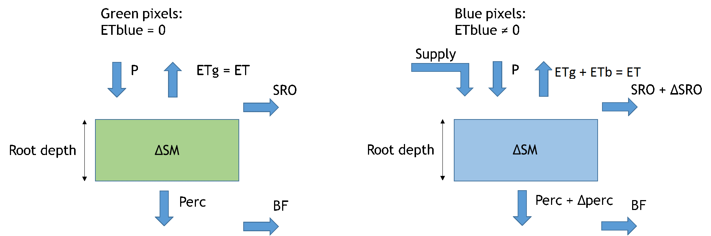
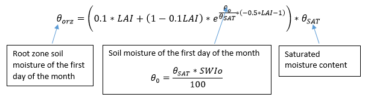
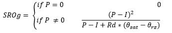
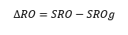
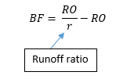

# Waterbal
Simple Waterpix model based on Water Balance

SIMPLIFIED VERSION of WaterPix.

The software computes a vertical water balance at the pixel level using remote sensing inputs and it is a simplified version of the WaterPix model. Main inputs, calibration parameters and outputs with their characteristics are listed in the table below.

| **Inputs** |
| --- |
| _Variable_ | _Source_ | _Spatial Resolution_ | _Temporal resolution_ |
| Precipitation | WaPOR | Resampled to 380 m | Monthly |
| Actual Evapotranspiration | WaPOR | Resampled to 380 m | Monthly |
| LAI | MODIS (MOD15) | Resampled to 380 m | Monthly |
| SWI –soil water index- | ASCAT | Resampled to 380 m | Monthly |
| SWIo –SWI first day of the month- | ASCAT | Resampled to 380 m | Monthly |
| SWIx –SWI last day of the month- | ASCAT | Resampled to 380 m | Monthly |
| ET green | Estimated from ET, ETref and P using Budyko theory | Resampled to 380 m | Monthly |
| ET blue | Estimated from ET, ETref and P using Budyko theory | Resampled to 380 m | Monthly |
| Interception | WaPOR | Resampled to 380 m | Monthly |
| Runoff Ratio (SRO/TRO) | Computed from GLDAS | Resampled to 380 m | Yearly |
| Saturated Water Content | HiHydroSoil | Resampled to 380 m | Static |
| Root depth | Root depth based on LULC | Resampled to 380 m | Static |
| Land use land cover | Developed for the project | 380 m | Static |
|   |   |   |   |
| **Parameters** |   |   |   |
| _Name_ | _Definition_ | _Range_ |
| Rootdepth\_par | Multiplier of rootdepth map. The higher the parameter the higher the moisture content and the percolation, and the lower the surface runoff and the base flow | 0.5 - 5 |
| Min Runoff ratio | Limit the value of the Runoff Ratio | 0 - 1 |
| Filter\_par | Baseflow filter parameter (monthly partitioning of runoff ratio) | 0 - 1 |
|   |   |   |   |
| **Outputs** |   |   |   |
| _Variable_ | _Definition_ | _Spatial Resolution_ | _Temporal resolution_ |
| SRO | Surface Runoff | 380 m | Monthly and yearly |
| ΔSRO | Incremental surface runoff generated because of water supply (e.g. irrigation) | 380 m | Monthly and yearly |
| BF | Base flow | 380 m | Monthly and yearly |
| ΔBF | Incremental base flow generated because of water supply (e.g. irrigation) | 380 m | Monthly and yearly |
| RO | Total runoff: Surface Runoff + Base flow | 380 m | Monthly and yearly |
| ΔSM | Change in moisture change | 380 m | Monthly and yearly |
| perc | Percolation | 380 m | Monthly and yearly |
| Δperc | Incremental percolation generated because of water supply (e.g. irrigation) | 380 m | Monthly and yearly |
| Supply | Water Supply | 380 m | Monthly and yearly |

The main fluxes considered by the model are:

 
There are five main computational steps:

**(1) Compute ΔSM as a function of ASCAT data, root depth and LAI**

Similarly we compute for the last day of the month and for the monthly average. This equation is based on Bastiaanssen et al., 2012.

Then                                 

**(2) Estimation of Water Supply for blue pixels.**

Assumption of consumed fraction is made for each land use class as follow:

| Land use class | Consumed fraction |
| --- | --- |
| Forest | 1.00 |
| Scrubland | 1.00 |
| Rainfed crops | 1.00 |
| Forest plantations | 1.00 |
| Natural water bodies | 0.15 |
| Wetland | 0.15 |
| Natural grassland | 0.70 |
| Other (non-manmade) | 0.40 |
| Irrigated crops | 0.80 |
| Managed water bodies | 0.40 |
| Other | 0.40 |
| Residential | 1.00 |
| Greenhouses | 0.95 |
| Aquaculture | 0.20 |

This values can be adjusted in calibration phase.

**(3) Estimate surface runoff.**

The computation is based on a modified version of the SCS flow equation (Schaake et al., 1996; Choudhury &amp; DiGirolamo, 1998).

Green component in green pixels:

Surface runoff:

Incremental surface runoff is computed as:

**(4) Estimate percolation as the residual of the root zone water balance.**

Perc=P+supply−ET−∆SM−SRO

To compute the incremental percolation we estimate the green component of percolation in blue pixels:

Percg=P−ETg−∆SM−SROg

Then: ∆perc=Perc−Percg=supply−∆RO−ETb

**(5) Estimate base flow as a function of surface runoff and runoff ratio.**

Runoff ratio r was distributed over the months using the filter\_par and the minimum r parameter.

**References**

Bastiaansen, W. G. M., Cheema, M. J. M. Immerzeel, W. W., Miltenburg, I. J.,  and Pelgrum, 2012. Surface energy balance and actual evapotranspiration of the transboundary Indus Basin estimated from satellite measurements and the ETLook model. Water Resources Research, Vol. 48, W11512, doi: 10.1029/2011WR010482.

Choudhury, B. J., and DiGirolamo, N. E., 1998. A biophysical process-based estimate of global land surface evaporation using satellite and ancillary data. I. Model description and comparison with observations. Journal of Hydrology, 205, pp. 164-185.

Schaake, J. C., Koeren, V. I., and Duan, Q.-Y., 1996. Simple water balance model for estimating runoff at different spatial and temporal scales. Journal of Geophysical Research, Vol. 101, No. D3, pp. 7461-7475.
